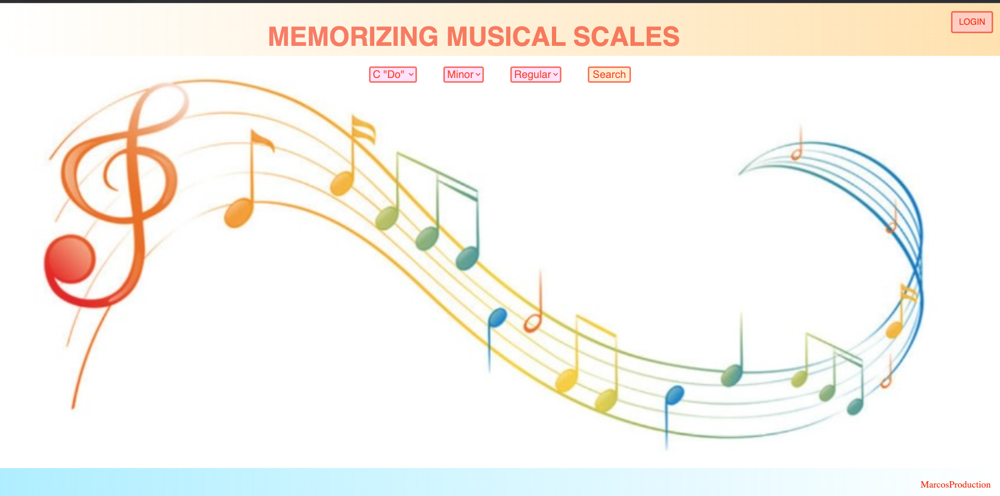
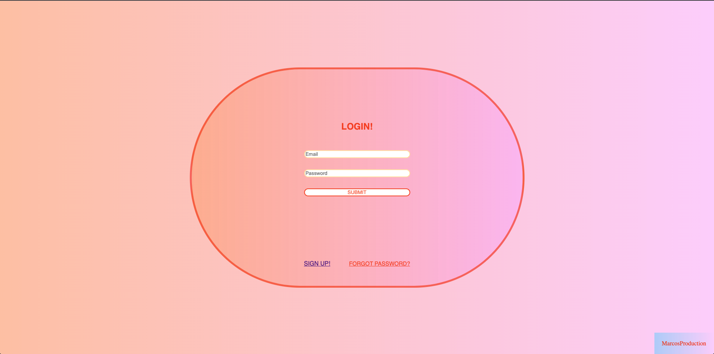
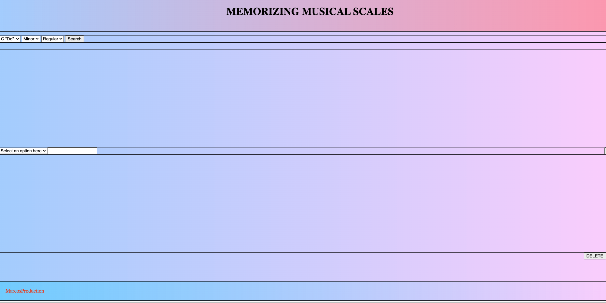

# Memorizing-Musical-Scales

### Home Page

### Login Page

### User Page

# The App

Memorizing Musical Scales gives users the opportunity to find the family of chords for any given musical note and create, build and update multiple musical progressions.

## Creating a User Account and Login

Create or access your unique and secure user account with your email and encrypted password by clicking on  the LOGIN button on the top right of the homepage.

## Using the App

On your user page, you can search families of chords by a specific NOTE by clicking the note on the drop down menu and dragging and dropping the chords to create and name your own musical progression. After you create, name and save your progression, you can find it again in the dropdown menu to view, edit or delete it. 

# Technologies
- HTML
- CSS
- JavaScript
- Node.js
- Express
- Mangoosse

